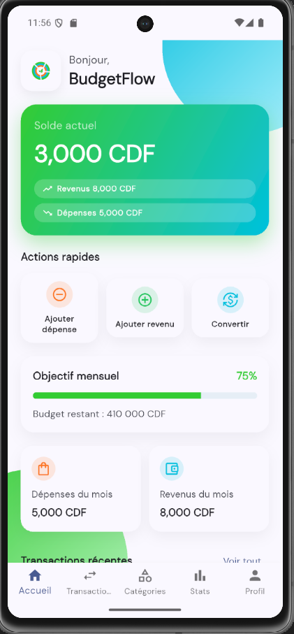
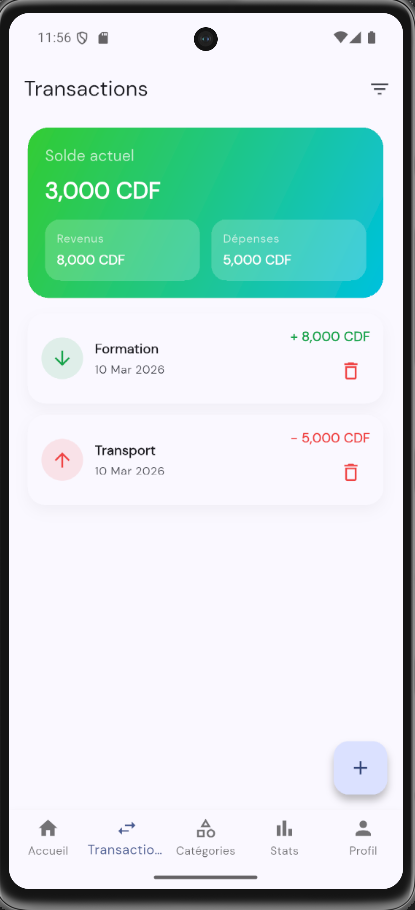
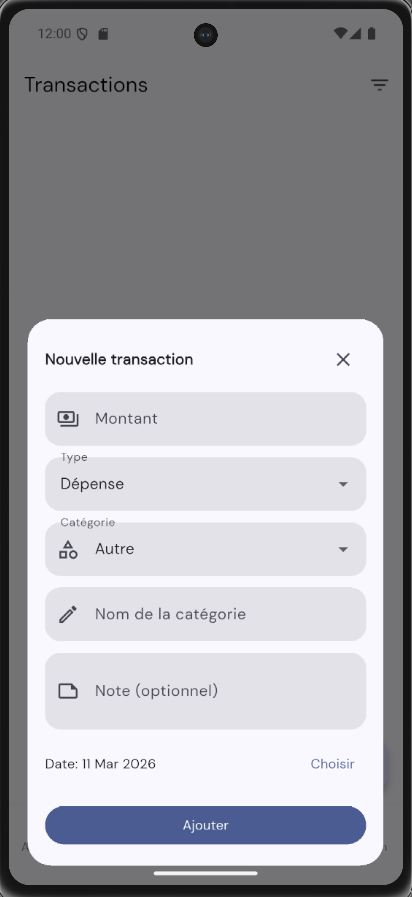
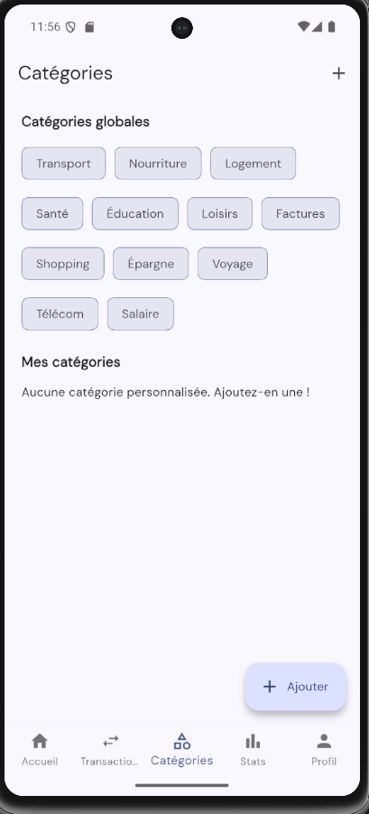
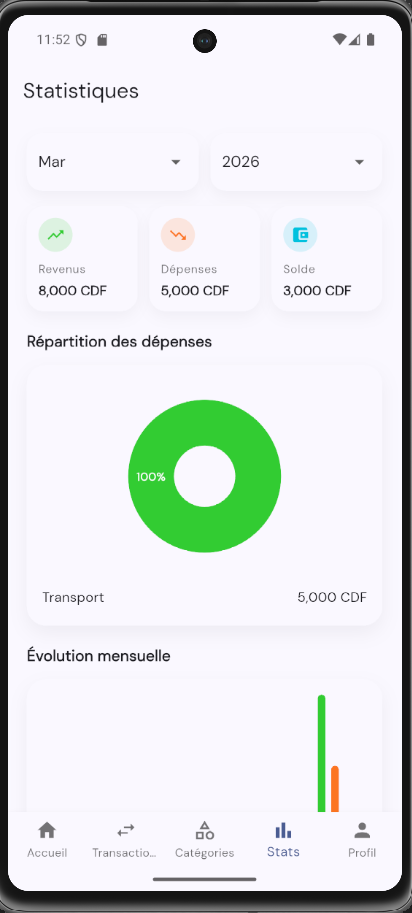
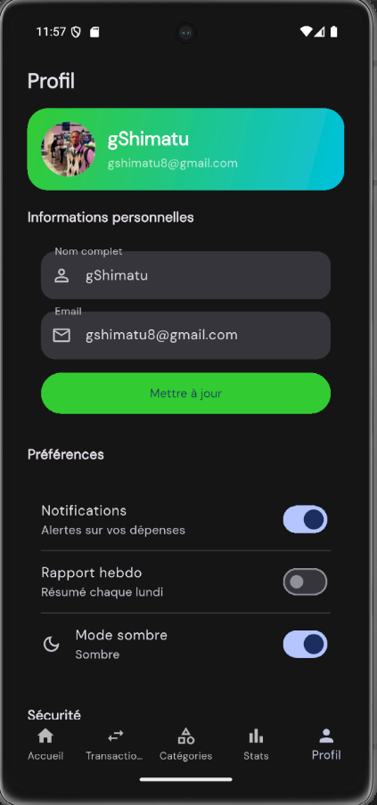
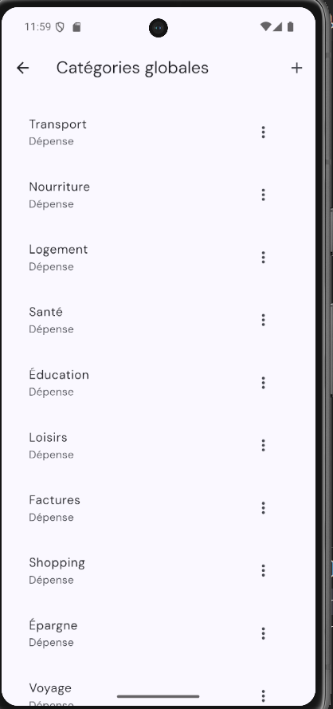
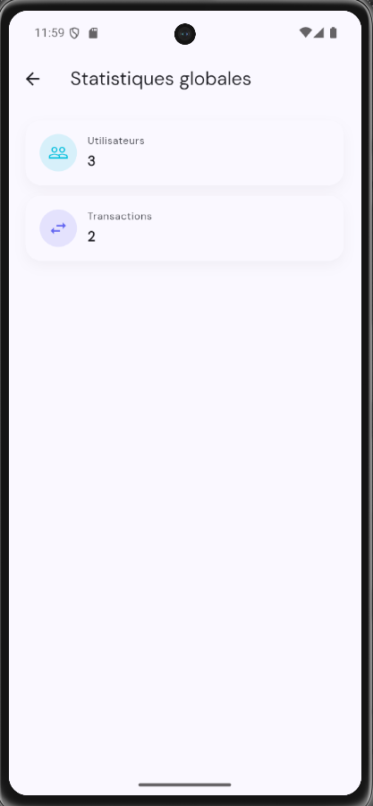
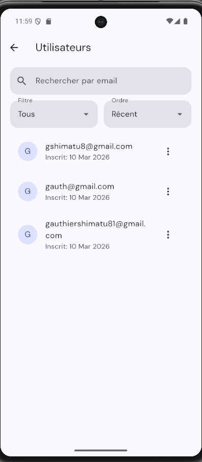

# Budget Flow

Application mobile de gestion de budget personnel avec authentification, gestion des transactions, statistiques et espace admin.

## Fonctionnalites
- Authentification email/mot de passe et Google.
- Gestion des transactions: ajout, modification, suppression.
- Categories globales et categories personnelles.
- Statistiques utilisateur (solde, repartition, evolution).
- Profil utilisateur avec preferences, theme clair/sombre, changement de mot de passe.
- Espace administrateur (categories globales, gestion utilisateurs, statistiques globales).
- Conversion de devises via API externe.

## Technologies
- Flutter (Dart)
- Firebase Auth
- Cloud Firestore
- Provider
- fl_chart
- flutter_dotenv

## Prerequis
- Flutter SDK installe
- Un projet Firebase configure (Android)
- Un appareil/emulateur Android

## Configuration

### 1. Installer les dependances
```bash
flutter pub get
```

### 2. Ajouter la configuration Firebase
1. Cree une app Android dans Firebase.
2. Telecharge `google-services.json`.
3. Place le fichier ici:
```text
android/app/google-services.json
```

### 3. Configurer les variables d environnement
Le projet lit la cle API de conversion depuis `.env`.

Fichier: `.env`
```env
EXCHANGE_RATE_API_KEY=VOTRE_CLE_ICI
```

### 4. Lancer l application
```bash
flutter run
```

## Build APK (partage)
```bash
flutter build apk --release
```
APK genere:
```text
build/app/outputs/flutter-apk/app-release.apk
```

## Règles Firestore (extrait)
Le fichier local est `firestore.rules`. Pense a publier les regles dans la console Firebase.

## Admin
Pour activer le role admin:
1. Ouvrir `users/{uid}` dans Firestore.
2. Mettre `role` a `admin`.
3. Relancer l application.

## Structure du projet (resume)
```text
lib/
  controllers/    Logique metier et etat (Provider)
  models/         Modeles de donnees
  services/       Acces Firebase et API externe
  views/          Ecrans UI (auth, home, admin)
  routes/         Routing
```

## Captures d'ecran
Accueil


Transactions


Ajout transaction


Categories (utilisateur)


Statistiques (utilisateur)


Profil (mode sombre)


Admin - Categories globales


Admin - Statistiques globales


Admin - Gestion utilisateurs


## Liens utiles
```text
Flutter: https://docs.flutter.dev/
Firebase Console: https://console.firebase.google.com/
API : https://app.currencyapi.com/
```
